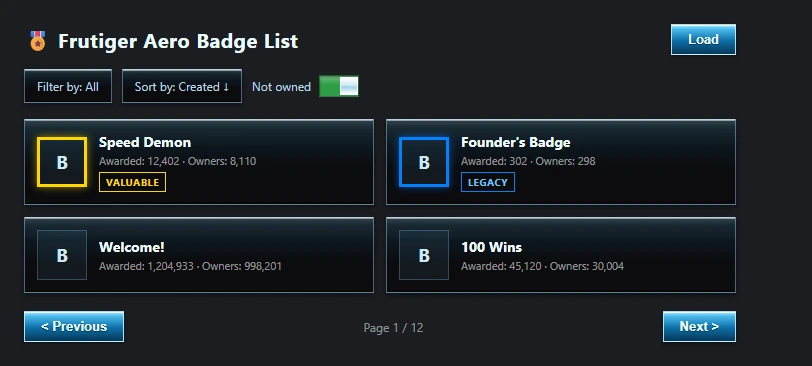

# 🎖️ Aero Badge List 🎖️ (Extension)

## 📜 Description 📜

Aero Badge List is a fork of [Advanced Badge List](https://github.com/meowbee-github/advancedbadgelist), a robust extension designed for badge collectors on Roblox, offering an enhanced badge management experience. This fork reskins the UI in a glossy Frutiger Aero style — sharp square edges (no rounded corners anywhere), glass-like panels, and glossy gradient buttons — while keeping all the original functionality (filters, ownership checking, badge refreshing, Cloud Key support for bulk ownership checks).

## 🛠️ Installation 🛠️

### 🌐 Supported Browsers 🌐

- Chrome
- Opera GX (PC)
- Kiwi Browser (Mobile)
- Firefox (PC)

### 📥 How to Install (Chrome / Opera GX / Kiwi) 📥

1. Download the extension from [aero-badge-list_v2.0.1.zip](https://github.com/AmaiSharkyuu/Aero-Badge-List/raw/main/aero-badge-list_v2.0.1.zip).
2. Extract the downloaded zip file.
3. Navigate to your browser's Extensions Tab and enable "Developer Mode".
4. Click on "Load Unpacked" and select the extracted "advancedbadgelist" folder.
5. The plugin will be added to the bottom of the game page.

### 🦊 How to Install (Firefox) 🦊

1. Download and extract the zip as above.
2. Go to `about:debugging#/runtime/this-firefox`.
3. Click "Load Temporary Add-on" and select `manifest_firefox.json` inside the extracted "advancedbadgelist" folder.

**Note:** Firefox temporary add-ons are removed when the browser closes and need to be reloaded each session — this is a Firefox limitation, not a bug in the extension.

## 🎨 What's different from the original 🎨

- Frutiger Aero visual theme: glossy blue glass panels and buttons, zero `border-radius` anywhere.
- Badge rarity borders: Valuable = gold, Legacy = blue, NVL = red, each with a subtle matching glow.
- Built-in theme picker (ABL Settings → Theme): Aero (default), Monochrome, or a Custom accent color of your own.
- Cleaned up dead/commented-out code from the base project.
- Host permissions narrowed to only what the extension actually needs (least privilege).
- Native Firefox manifest (`manifest_firefox.json`) with matching permissions.

## 🎖️ Credits 🎖️

### Main Developers (original)

- **Jblocks12321**
  - [Roblox Profile](https://roblox.com/users/52282947/profile)
  - [Discord](https://discord.com/users/701081887388729427)

- **30l50**
  - [Roblox Profile](https://roblox.com/users/3185959435/profile)
  - [Discord](https://discord.com/users/247147740100952094)

### Guide Writer (original)

- **Meowbee**
  - [Roblox Profile](https://roblox.com/users/685485707/profile)
  - [Discord](https://discord.com/users/793692044307726337)

### Github Maintainer (original)

- **Dheeraj2008**
  - [Roblox Profile](https://roblox.com/users/682634751/profile)
  - [Discord](https://discord.com/users/514771097221070849)

### Aero Badge List fork

- **AmaiSharkyuu**
  - [Roblox Profile](https://www.roblox.com/users/1957141708/profile)
  - [Discord](https://discord.com/users/816654196047740979)

## 🔑 Cloud Keys 🔑

To check badge ownership in bulk faster, you can add your own Roblox Open Cloud API key:

1. Head to [Roblox API Keys](https://create.roblox.com/dashboard/credentials).
2. Click "Create API Key".
3. Give it any name and description.
4. Select "inventory" under "Select API System".
5. Select "read" under "Select Operations to Add".
6. Generate the key and save it somewhere safe (Roblox only shows it once).
7. Go to `roblox.com/my/account`, open the "ABL Settings" tab added by the extension, then "Cloud Keys", and paste your key there.

Your key is stored locally in your browser only — it is never sent anywhere except Roblox's own API.

## ❓ FAQ ❓

Welcome to the Frequently Asked Questions (FAQ) section where common queries about the Aero Badge List extension are addressed.

### Basic Settings

#### Q: What is the 'Aero Badge List' plugin?
A: It's a fork of Advanced Badge List that assists badge collectors by providing comprehensive information and efficient badge sorting capabilities, with a reworked glossy, square-edged UI.

#### Q: How do I set up the plugin?
A: Refer to the installation instructions in the Installation section above.

#### Q: What browsers are compatible with the plugin?
A: Chrome, Opera GX (PC), Kiwi Browser (Mobile), and Firefox (PC), as mentioned in the Installation section.

### Buttons

#### Q: How do I use the plugin?
A: Simply navigate to a game with badges — the badge list appears at the bottom of the page. Use the filter and sort controls to narrow it down, and "Load" to fetch more badges.

For any further questions not covered here, feel free to open an issue on this repository.
